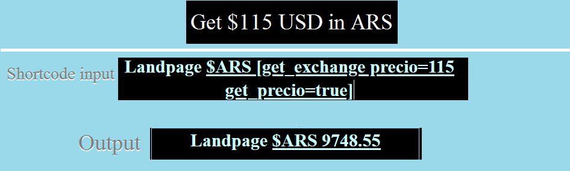

<h1 align=center> === Empanada exchange ===</h1>

**Contributors:** torswq  
**Tags:** currency, currencyexchange, marketing, business, e-commerce  
**Requires at least:** 5.5  
**Tested up to:** 5.6  
**Donate link:** mailto:torsw@protonmail.com  
**Stable tag:** trunk  
**Requires PHP:** 7.0  
**License URI:** https://www.gnu.org/licenses/gpl-3.0.html  
**License:** [GPLv3](LICENSE)  
  
*Plugin for Argentinian-based websites. Retrieve in real-time dolar values.*
  

<h2 align=center>== Description ==</h2>

This plugins is intended for people that must develop a website using wordpress in Argentina or for it.  
The plugin retrieves the official dolar value for Argentina, with or without taxes 
*i.e Country taxes and witholding of earnings (Impuesto PAIS y retención de ganancias).*.  
&emsp;This plugin does not store the history of the value, instead it retrieves the current value and stores it 
in the database in order to use it as an ARS - USD value translator.  
  
* These are the parameters of the shortcode.
	- `[get_exchange precio=123]`: Set an USD value and translate it to ARS.
	- `[get_exchange get_precio=true]`: If you do not set this parameter, you will not return the **precio** value.
	- `[get_exchange impuesto_pais=true]`: Apply the "Country tax" for the dollar, which is the 30% of surcharge *e.g $1 USD = $100 ARS. With "Impuesto PAIS" $1 USD = $130 ARS*
	- `[get_exchange retencion_ganancias=true]`: Apply the "Witholding of earnings", which is the 35% of surcharge *e.g $1 USD = $100 ARS. With "Retencion de ganancias" $1 USD = $135 ARS*
  
**Note: There is something called solidarity dollar, that is the 65% of surcharge (this means that Country tax, and witholding of earnings are appliead), this dollar is used when foreign people wants to buy something in dollars instead of Argentinian pesos.** 
  
* Some examples:
	- Get the current value of $1 USD in ARS: `[get_exchange]`
	- Get solidarity dollar: `[get_exchange impuesto_pais=true retencion_ganancias=true]`
	- Get $15 USD to ARS: `[get_exchange precio=15 get_precio=true]`
	- Get $15 solidarity dollars: `[get_exchange impuesto_pais=true retencion_ganancias=true precio=15 get_precio=true]`
  
------------------
<h3 align=center>== Frequently Asked Questions ==</h3>

* Q: I tried to search for this plugin on wordpress plugin search, why it does not appears?
	- A: I am having problems with [Wordpress HTTP-API](https://developer.wordpress.org/plugins/http-api/), if i do not use it, you can't upload your plugin.
  
* Q: How do i use it?
	- A: Simple, you must use the shortcode *`[get_exchange]` *and you will get the value of the dollar.  
  
* Q: I keep getting `-1 (Plugin sin configurar)`
	- A: This means that you must go to settings and select the source to retrieve the USD value in ARS. Currently i only code 1 source. (dolarsi.com)

* Q: I am getting `-4 Fallo la actualizacion del dolar en la base de datos` ==
	- A: This means that you have no access to the database, you can try to run the plugin with wordpress debug-mode set to **true**

#### = Is there an english version of this plugin? =
  
There is no english version of this plugin yet, that is a feature i am working on.
 
#### = What about english users? We do not understand spanish =
  
I must prioritize my native country, since is an Argentinian oriented plugin, it would make no-sense if i write this plugin on english, 
what about the people who do not know english?
 
#### == Screenshots ==

1. 
 
##### == Changelog ==
= 0.1 =  
**First realease.**
  
###### == Upgrade Notice ==
* 0.1: Plugin exist, use it. 
* 0.0: Not recommended, plugin does not exist.
 
Features:

1. Retrieve USD to ARS value with argentinian taxes.
2. Retrieve USD price and translate it to ARS.
  
TODO:
  
* English translation
* Add more sources to retrieve.
* Add setting to set update time.
  
Here's a link to [Wordpress cloudflare plugin](https://wordpress.org/plugins/cloudflare/) and one to [Markdown's Syntax Documentation][https://www.markdownguide.org/basic-syntax/].
  
[markdown syntax]: https://daringfireball.net/projects/markdown/syntax
